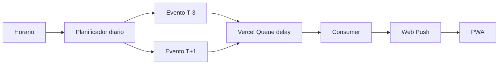

# Arquitectura propuesta

## Capas

1. **UI / PWA** — Next.js App Router.
2. **Dominio** — reglas de agenda, estados y exclusión mutua.
3. **Aplicación** — comandos `clockIn`, `clockOut`, `acknowledgeReminder`.
4. **Persistencia** — PostgreSQL.
5. **Notificaciones** — Web Push.
6. **Scheduling** — Vercel Cron diario para preparar trabajos + Vercel Queues con entrega diferida.
7. **Integración de timbrado** — adaptador desacoplado.

## Flujo de recordatorio



## Por qué no depender de polling del navegador

Un temporizador dentro de una pestaña no es fiable si el navegador se suspende o la app está cerrada. El dashboard puede hacer comprobaciones locales como respaldo, pero el recordatorio de producción debe originarse en el servidor.

## Estrategia Vercel

En planes donde el cron frecuente no sea viable, ejecutar un cron diario que programe por adelantado los eventos del día mediante mensajes diferidos. El diseño evita depender de un cron por minuto.

## Integración institucional

```text
Domain Service -> PunchAdapter -> MockAdapter | OfficialApiAdapter | ApprovedAutomationAdapter
```

`OfficialApiAdapter` solo se implementa cuando exista documentación o autorización suficiente.
