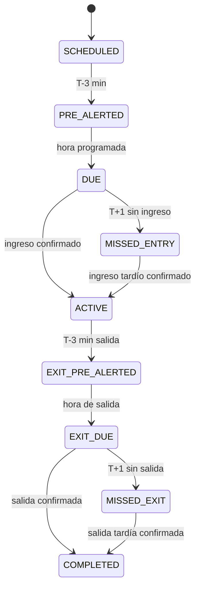

# Máquina de estados

## Estado de bloqueo transversal

Una actividad en `DUE` o `MISSED_ENTRY` no puede pasar a `ACTIVE` si existe otra sesión activa. En ese caso la UI muestra `BLOCKED_BY_ACTIVE_SESSION` como estado derivado, pero no se crea una segunda sesión.

## Invariantes

- `count(ACTIVE sessions per user) <= 1`
- `exitAt >= entryAt`
- `actual event` nunca borra el `scheduled event`
- una transición repetida con la misma clave es idempotente
